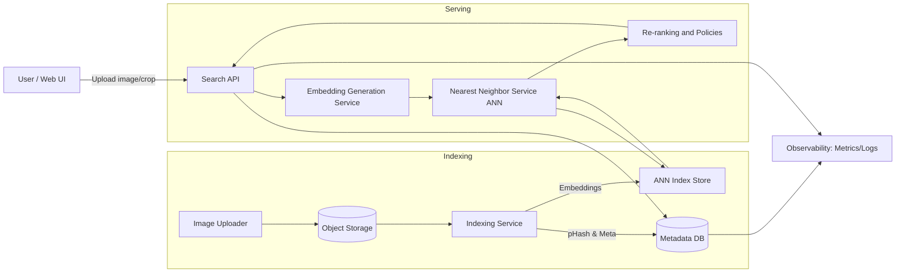
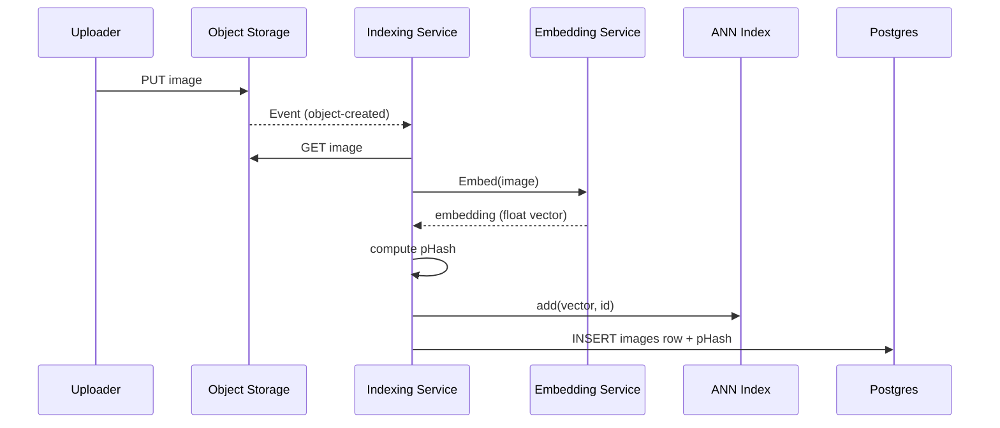
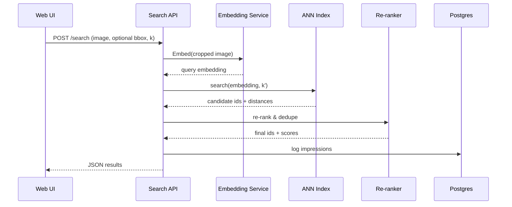
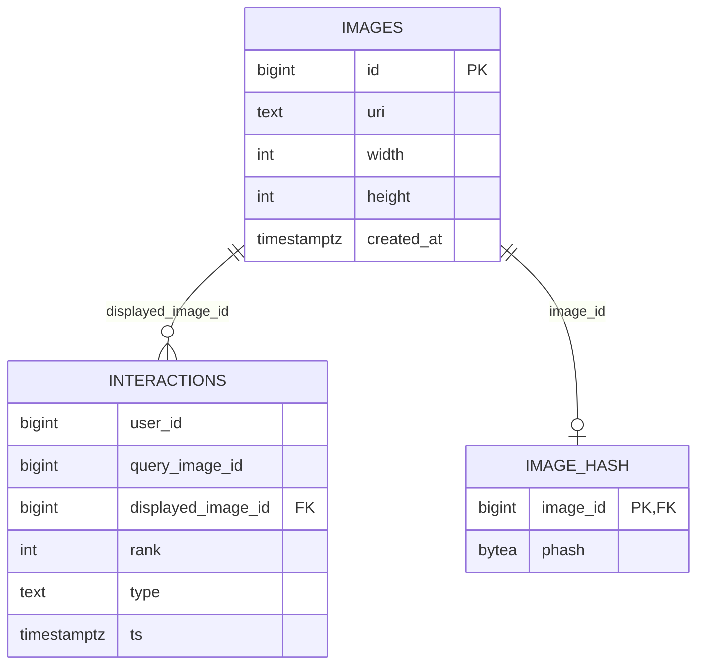

# Visual Search System — End‑to‑End Architecture

> Pinterest‑like **image‑to‑image** visual search built from scratch. This document explains the problem, system design, components, data model, ML training, retrieval, APIs, deployment, observability, scaling, and roadmap..

---

## Table of Contents

1. [Problem Statement & Requirements](#problem-statement--requirements)  
2. [System Overview](#system-overview)  
3. [End-to-End Flows](#end-to-end-flows)  
4. [Data Model](#data-model)  
5. [Machine Learning](#machine-learning)  
6. [Indexing Pipeline](#indexing-pipeline)  
7. [Query/Serving Pipeline](#queryserving-pipeline)  
8. [API Design](#api-design)  
9. [Deployment & Infrastructure](#deployment--infrastructure)  
10. [Observability & Operations](#observability--operations)  
11. [Security & Privacy](#security--privacy)  
12. [Evaluation (Offline & Online)](#evaluation-offline--online)  
13. [Performance & Capacity Planning](#performance--capacity-planning)  
14. [Testing Strategy](#testing-strategy)  
15. [Roadmap](#roadmap)  
16. [Appendix: Local Dev Quickstart](#appendix-local-dev-quickstart)

---

## Problem Statement & Requirements

**Goal.** Given a **query image (or a crop of an image)**, retrieve and rank **visually similar images** from a very large corpus.  
**Out of scope.** Personalization, text queries, moderation (can be added later).  
**Primary interaction.** **Clicks** on results (logged for metrics and future training).  
**Latency target.** Low latency search at scale (100B–200B images feasible via ANN).  
**Similarity source.** **Pixels only** (no metadata usage in the baseline).  
**Inputs.** Query image (JPEG/PNG), optional bounding box for crop.  
**Outputs.** Ranked list of similar image IDs + optional distances/scores.  

**Non‑functional:**
- Horizontal scalability (sharding for embeddings & ANN indices).
- Cost efficiency (product quantization, cold/hot tiering).
- Reliability (health checks, backpressure, retries).
- Observability (metrics, tracing, logs, A/B testing).

---

## System Overview

Mermaid **context diagram**:



**Key components:**
- **Embedding Generation Service (EGS):** Preprocess + model forward pass → normalized embedding.
- **Nearest Neighbor Service (NN):** Approximate k‑NN over vector index (e.g., FAISS IVF‑PQ + OPQ).
- **Re‑ranking Service:** Business rules, near‑duplicate removal, policy filters.
- **Indexing Service:** Ingest new images, compute embeddings & pHash, update ANN index + metadata DB.
- **Object Storage:** Raw image files (e.g., S3/MinIO).
- **Metadata DB:** Minimal metadata + interaction logs (Postgres).

---

## End-to-End Flows

### 1) Indexing (ingest → searchable)



### 2) Query (search)



---

## Data Model

### Tables (Postgres)

```sql
-- images: minimal metadata
CREATE TABLE images (
  id BIGSERIAL PRIMARY KEY,
  uri TEXT NOT NULL,          -- s3://bucket/key.jpg
  width INT, height INT,
  created_at TIMESTAMPTZ DEFAULT now()
);

-- interactions: online metrics & future training
CREATE TABLE interactions (
  user_id BIGINT,
  query_image_id BIGINT,
  displayed_image_id BIGINT,
  rank INT,
  type TEXT CHECK (type IN ('impression','click')),
  ts TIMESTAMPTZ DEFAULT now()
);

-- near-duplicate support
CREATE TABLE image_hash (
  image_id BIGINT PRIMARY KEY REFERENCES images(id),
  phash BYTEA  -- 64-bit perceptual hash
);
```

Mermaid **ER diagram**:



### Vector Index

- Stored as **ANN index files** (e.g., FAISS `IndexIVFPQ` + OPQ transform).  
- Sharded across nodes (e.g., hash on `image_id` or range sharding).  
- **Cold/Hot tiering:** frequently retrieved vectors in RAM; bulk on SSD/NVMe.

---

## Machine Learning

### Objective & Framing
- **Representation learning** with **contrastive training** (self‑supervised, SimCLR/InfoNCE).  
- **Backbone:** ViT‑B/32 (OpenCLIP) or ResNet50; projection head to desired dim (e.g., 256).  
- **Input:** RGB image or **crop**; no metadata in baseline.  
- **Similarity:** cosine or dot product; L2 for FAISS IVF‑PQ.

### Preprocessing
- Resize to fixed size (e.g., 224×224).  
- Normalize with CLIP means/stds.  
- Color mode normalization (RGB).

### Training Data Construction
- **Self‑supervision:** two strong augmentations of same image form **positive pair**; other images act as **negatives** within batch.  
- Optionally, mix with **click‑derived positives** once available.

### Loss
- **InfoNCE / NT‑Xent** over projected, normalized embeddings.  
- Temperature `τ` ~ 0.07 (tunable).

### Checkpoints & Registry
- Store backbone + projection head versions (semver); keep a **model registry** pointer for Serving.  
- Rollout via blue/green or canary.

---

## Indexing Pipeline

**Responsibilities:**
- Pull new images (S3 events / batch).  
- Compute **embedding** and **pHash**.  
- Upsert into ANN index & Postgres.  
- Periodic **rebuild** or **add‑only** with on‑the‑fly training updates.

**Optimizations:**
- **Batching**: embed images in batches (GPU friendly).  
- **Pre‑allocation**: ANN shards with capacity planning.  
- **Quantization**: IVF‑PQ (M=64, 8‑bit) + **OPQ** pre‑transform.

**Pseudo‑routine:**
```
for each new_object in object_events:
  img = load_from_s3(new_object.uri)
  emb = embed(img)              # (D,)
  h = phash(img)                # 64-bit int
  shard = pick_shard(new_object.id)
  ann[shard].add(id=new_object.id, vec=emb)
  pg.images.insert(...); pg.image_hash.upsert(...)
```

---

## Query/Serving Pipeline

**Embedding Generation Service (EGS):**
- Receive image (and optional `bbox`), apply crop & preprocessing.  
- Run backbone → embedding, L2‑normalized; apply projection head; normalize again.  
- Expose gRPC/HTTP for high throughput (inference server).

**Nearest Neighbor (NN) Service:**
- Apply **OPQ** transform → ANN search.  
- Tune **nprobe**/**efSearch** (depending on IVF/HNSW) for latency/recall trade‑off.  
- Retrieve top‑`k'` (k prime, e.g., 200) candidates.

**Re‑ranking:**
- Drop **near‑duplicates** (Hamming distance on pHash < threshold).  
- Remove low‑quality or blocked sources (if policies exist).  
- Return top‑`k` (e.g., 50) with scores.

---

## API Design

### REST (FastAPI)

**Search**
```
POST /search
Content-Type: multipart/form-data
Fields:
  - image: file (required)
  - bbox: string "x1,y1,x2,y2" (optional)
  - k: int (optional, default=50)

Response 200 (application/json):
{
  "results": [
    {"id": 123, "score": 0.812, "uri": "s3://bucket/key.jpg"},
    ...
  ],
  "latency_ms": 47
}
```

**Click Logging**
```
POST /click
Body JSON:
{
  "user_id": 42,
  "query_image_id": 999,
  "displayed_image_id": 123,
  "rank": 1
}
Response 204
```

**Health**
```
GET /health -> {"ok": true}
```

### gRPC (optional)
- `Embed(image_bytes) -> Vector`
- `Search(Vector, k) -> TopK{ids, distances}`

### OpenAPI Snippet

```yaml
paths:
  /search:
    post:
      summary: Search similar images
      requestBody:
        content:
          multipart/form-data:
            schema:
              type: object
              properties:
                image: { type: string, format: binary }
                bbox: { type: string, example: "34,12,210,190" }
                k: { type: integer, default: 50 }
      responses:
        "200": { description: OK }
  /click:
    post:
      summary: Log click event
      requestBody:
        content:
          application/json:
            schema:
              type: object
              properties:
                user_id: { type: integer }
                query_image_id: { type: integer }
                displayed_image_id: { type: integer }
                rank: { type: integer }
      responses:
        "204": { description: No Content }
```

---

## Deployment & Infrastructure

### Environments
- **Local dev:** Docker Compose (API, Postgres, MinIO).  
- **Staging/Prod:** Kubernetes (GPU nodes for EGS), StatefulSets for ANN shards, HPA.

### Reference Topology
- **EGS**: GPU inference pods with autoscaling.  
- **NN Service**: CPU‑heavy; keep ANN shards in RAM/SSD.  
- **PG**: Managed Postgres (HA).  
- **Object Storage**: S3 or MinIO.  
- **Gateway**: NGINX/Envoy ingress, TLS.  
- **Queue**: Kafka/Redis Streams for indexing events.

### Config & Secrets
- `.env` for non‑secret config; secrets in Vault/KMS/K8s Secrets.  
- Feature flags for model/ANN rollout (blue/green).

---

## Observability & Operations

- **Metrics**: p50/p95 latency, recall proxy, nprobe/efSearch, QPS, GPU/CPU/mem, CTR, error rates.  
- **Tracing**: end‑to‑end trace (API → EGS → NN → Rerank → PG).  
- **Logging**: structured JSON; correlation IDs per request.  
- **Dashboards**: request latency, ANN search time, queue lag, index size.  
- **Alarms**: elevated latency, search errors, ANN shard down, index desync.  
- **A/B Testing**: model versions, ANN params, re‑rank policies.

---

## Security & Privacy

- **Transport security**: TLS everywhere.  
- **Authentication**: service‑to‑service mTLS; user JWT if needed.  
- **Authorization**: image access policies (private vs public).  
- **Content handling**: virus scanning on upload (optional).  
- **PII**: none required for baseline; interactions table can anonymize `user_id` or use hashed IDs.  
- **Abuse**: rate limiting, request size caps, safe‑list MIME types.  

---

## Evaluation (Offline & Online)

**Offline (ground truth with similarity scores 0..5):**
- **nDCG@k** (primary).  
- **mAP@k** (secondary when binary relevance is used).

**Online:**
- **CTR** = clicks / impressions.  
- **Time spent** on results (optional).  
- **Latency SLOs** (API, embedding, ANN, re‑rank).  
- **A/B**: compare variants with CUPED or sequential testing (if available).

**Offline nDCG@k formula:**
\[
DCG_p = \sum_{i=1}^{p} \frac{rel_i}{\log_2(i+1)}, \quad
nDCG_p = \frac{DCG_p}{IDCG_p}
\]

---

## Performance & Capacity Planning

**Vector size.** Example: 256‑D float32 → 1KB/vector; 512‑D → 2KB/vector.  
**Quantization.** IVF‑PQ (M=64, 8‑bit) with OPQ → ~64 bytes/vector.  
**Memory example:**
- **1B vectors (64B)** ≈ **~59.6 GiB** (plus index overhead).  
- **200B vectors** ≈ **~11.6 TiB** (tiered storage + sharding required).

**Tuning knobs:**
- IVF: `nlist` (≈ √N); runtime `nprobe`.  
- HNSW: `M`, `efConstruction`, runtime `efSearch`.  
- Trade‑off: recall ↑ ↔ latency ↑.

---

## Testing Strategy

- **Unit tests**: preprocessing, embedding shapes, ANN wrappers, pHash logic.  
- **Golden tests**: known pairs → expected nearest neighbors.  
- **Load tests**: k‑NN QPS vs latency; backpressure.  
- **Chaos**: shard unavailability, stale index, partial outages.  
- **Canary**: new model/index slice to 1–5% traffic first.

---

## Roadmap

**MVP**
- OpenCLIP + projection head (SimCLR)  
- Single‑node FAISS IVF‑PQ + OPQ  
- FastAPI `/search`, `/click`  
- Near‑dup removal via pHash  
- Offline nDCG@k script + CTR logging

**V1**
- Sharded ANN (FAISS on multiple nodes / Milvus or Qdrant alternative)
- Blue/green model & index rollout
- A/B experimentation platform
- Elastic inference for EGS (Triton/ONNX Runtime)

**V2+**
- Personalization (not in baseline)
- Text→Image search (add CLIP text encoder)
- Content moderation + smart cropping
- Active learning & human‑in‑the‑loop labeling

---

## Appendix: Local Dev Quickstart

```
# 1) Start infra
docker compose up -d

# 2) Train (toy set) & export projection head
python training/train_simclr.py --data_root ./data/images --epochs 5

# 3) Generate embeddings (script your own exporter)
python scripts/export_embeds.py --in ./data/images --out ./data/all_embeds.npy

# 4) Build ANN index
python scripts/build_index.py

# 5) Run API (if not via compose already)
uvicorn backend.api.main:app --host 0.0.0.0 --port 8000

# 6) Query
curl -F "image=@query.jpg" -F "bbox=30,20,220,200" -F "k=50" http://localhost:8000/search
```

**Repo layout** 
```
visual-search/
  backend/
    api/
    common/
    nn/
    rerank/
  training/
  infra/
  web/
  scripts/
  README.md
  ARCHITECTURE.md
```
